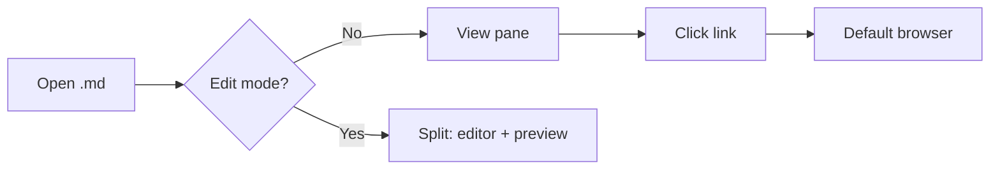
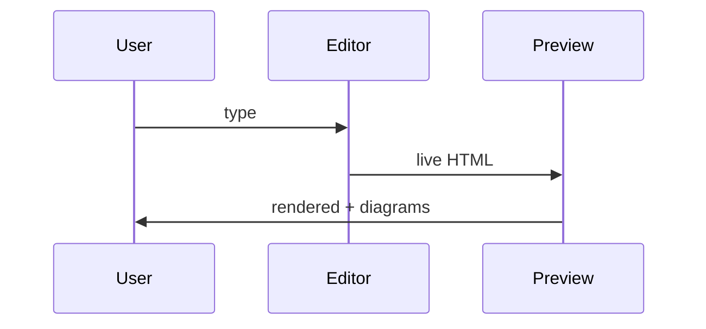

# Sample Markdown

Welcome to the **Markdown Editor** — a simple, lightweight editor built with Tauri + Svelte.

## Features

- Live split-pane preview
- Syntax highlighting in code blocks
- Dark mode (follows OS preference)
- `.md` file association
- Unsaved-change indicator

## Code sample

```python
def fibonacci(n: int) -> list[int]:
    """Return the first n Fibonacci numbers."""
    a, b = 0, 1
    out = []
    for _ in range(n):
        out.append(a)
        a, b = b, a + b
    return out

print(fibonacci(10))
```

```javascript
const greet = (name) => `Hello, ${name}!`;
console.log(greet("world"));
```

## Table

| Feature        | Status |
| -------------- | ------ |
| Open / Edit    | ✓      |
| Syntax colors  | ✓      |
| Dark mode      | ✓      |
| File assoc.    | ✓      |

## Quote

> Small is beautiful.

## Mermaid diagram





[Learn more about Tauri](https://tauri.app)
